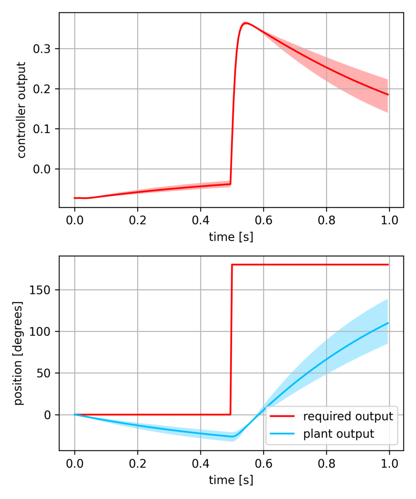

# libs_robotics
libs for robotics - localisation, mapping ...

## IMU

- complementary filter for sensor fusion
- low level driver [mpu6050](LibsDevices/mpu6050.h)
- IMU driver for sensor fussion [imu](LibsEmbedded/imu.h)
- firmware code [fw](tests/imu_avr_firmware)
- GUI PC app [app](tests/imu_visualisation)


## robust controll in pytorch

- pytorch is used for controller optimisation
- linear dynamical system (described as state space)
- controller can be linear or non-liear (GRU, LSTM ...)
- whole graph is differentiable, so torch can optimise whole problem
- Runge-Kutta is used for solving ODE's
- loss specifies controller behaviour

### computational graph overview (loss ommitted)


### linear controller is just 3 matrix multiplications
[code](LibsRobotics/controll/controller.py)


### servo controll with 20% parameters uncertaininty, using non-linear 64 units GRU



## particle filter

estimate position for local measurement, known map and relative position change


```python
#map size
height      = 150
width       = 150

particles_count = 512

#create same random grid map, numpy array (height, width, features)
map = LibsRobotics.MapGrid(height, width, 1)
map.random()

#create particle filter
partcile_filter = LibsRobotics.ParticleFilter(map.get_map(), particles_count)


#main loop
while True:
    dx, dy      = ... #obtain robot dx, dy

    observation = ... #obtain environment sensor observation (features)

    #compute particle filter
    partcile_filter.step(observation, dx, dy)

    #output
    ... = partcile_filter.position_x
    ... = partcile_filter.position_y
```


## points cloud matching

find transformation to match two point clouds
(scale, offset and rotation)


